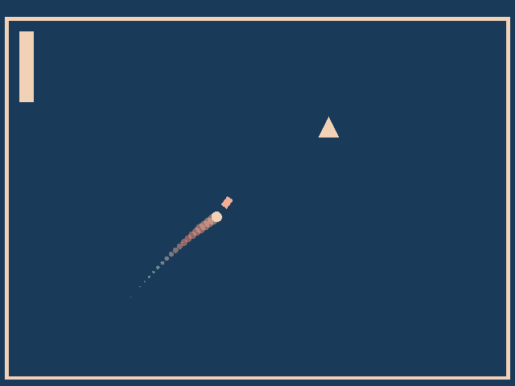

# (TODO: your game's title)

Author: Jasper Lessiohadi

Design: 
My game combines the way many golf games determine how powerful the stroke is (by holding down the space-bar to charge up the shot) with intentionally somewhat janky controls inspired by games like qwop.

Screen Shot:

How To Play:
Use 'a' or the left arrow key to aim towards the left and 'd' or the right arrow key to aim right. Hold the space-bar to charge up your shot (there is an indicator of how strong it will be in the upper left-hand corner of the screent). The goal is to collect the triangles that spawn around the screen.

Sources: None

This game was built with [NEST](NEST.md).
